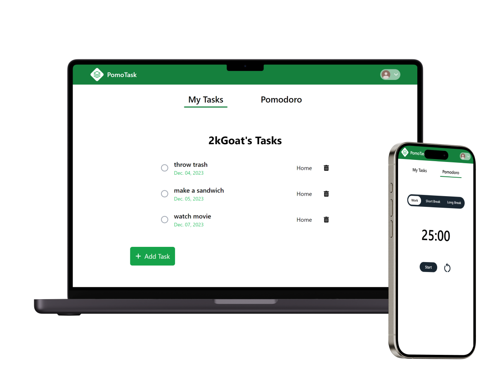

<h2 align="center">PomoTask</h2>

PomoTask is a web application that allows users to create and delete tasks, following CRUD functionality. It is also integrated with a Pomodoro timer where users have 25 minutes to focus on completing any personal tasks. After the 25 minutues work, they can have 5 minutes break. This website also has authentication where user tasks are saved in their accounts.

## Built with:
* React
* React Router
* Firebase
* TailwindCSS
* Vite

## Features:
* CRUD (Create, Read, Update, Delete) tasks functionality.
* Firebase Authentication.
* Pomodoro Timer.

